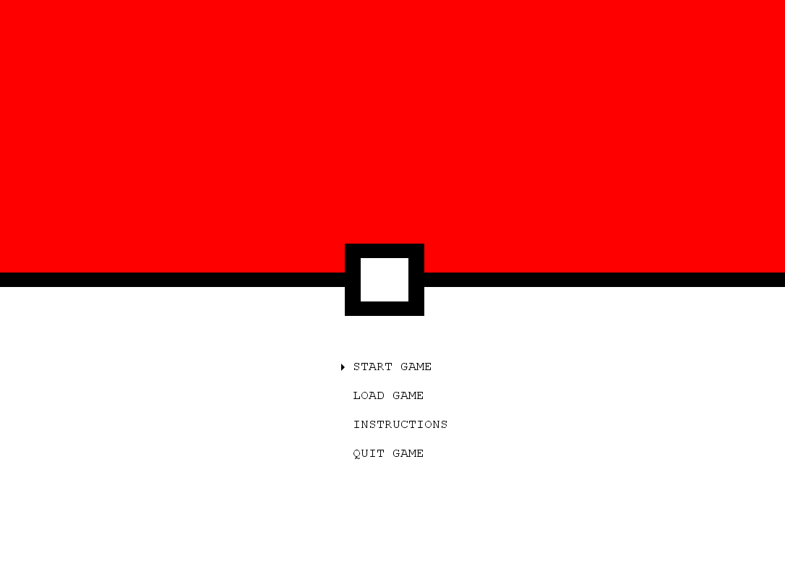
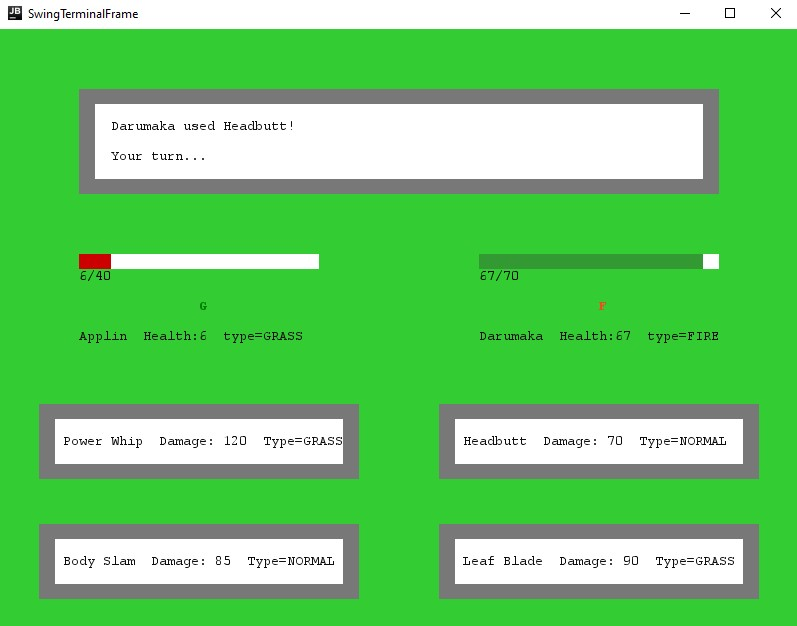

# POKÉMON
In this text character based rendition of Pokémon, you run around various maps battling pokémons.
You explore the map and if, by chance, you encounter yourself within the tall grasses, you may encounter a pokémon and fight it with your own team of pokémons.

This project is being developed by Gonçalo Alves (up201806451@fe.up.pt) and Pedro Seixas (up201806227@fe.up.pt) for LPOO 2019/20.

## GIF of game



## Implemented Features

- Moving the player: The player is able to move around the map with the arrow keys;
- Moving between routes: The player is able to move to different locations, by going to these little "holes" located in the side of the map;
- Pause Menu: By pressing the **ESC** key, the player has various options, such as: View the pokedex, View it's team of pokémons, View it's bag, Check the store, Save the game and Quit the game;
- Battle: The player can battle pokemons, when entering the tall grass;
- Music: There is background music in the route area and in battle;

### New Features!
- Catching pokémons and running from battles, simply press the **C**/**R** keys, respectively, to try and catch/run away;
- Switch between pokémons when battling, with the **S** key;
- View your team: select the option "Team" in the Pause Menu;
- Buy pokeballs in the store: select the option "Store" in the Pause Menu and buy with the **ENTER** key or sell with the **S** key;
- Starting Screen: you can start a new game, load a saved game, view the game's instructions and quit the game;
- Building: you can heal your pokémons by simply stepping on the red platforms and pressing the **ENTER** key;
- Save and Load your game: you can keep your player and your pokemón team when you exit the game;

#### Some screenshots of the initial features
|Pause Menu|Pokedex|
|:---:|:---:|
|||
|Battle|Building|
|||

#### The new features
###### All the images below were merely representations of the **new** features. They look different now!

|Start Screen|New Battle Screen (Includes the catch option and the graphical log)|
|:---:|:---:|
|||
|Pokémon team screen|Store screen|
|||
|Building - Outside View|Building- Inside View|
|||

## Planned Features

In this section are some features we could've implemented in the future:
- Switching from text based game to image based;
- Gyms and enemy trainers;


## Design

As we feel that some patterns either don't deserve a deep explanation or that are not as noteworthy, this initial part will reference some of them and briefly explain where they were applied. The second part will be dedicated to a more in-depth analysis.

### Some Patterns

We have applied the **Composite** pattern throughout the project (States). It's very useful when we need to represent part-whole hierarchies between objects and it also prevents **Data Clumps**.
We made use of the **Command** pattern for things such as **movement** or **menu selection**.
We also applied the **Observer** pattern so that, each time a state has been altered (player has moved, pokemon attacked another pokemon), the game and the game state adapt themselves to the changes. This pattern is very useful for when we want to update the drawing of the game.

### Creation of Map Elements

#### Problem in Context
At first, we wanted to design the map with different elements, such as: Walls, Grass and a Player. All of these require a Position, so that we could draw them later. If the class for each one of these elements was created with a Position, it could be perceived as a **Data Clump**.

#### The Pattern
We have solved this issue by applying inheritance. This solution allowed us to represent different elements with different subclasses. As such, there is no need to have repeated code in different classes.

#### Implementation
###### Disclaimer: Not all elements are represented in the image below


These classes can be found in the following files:
- [Element](../src/main/java/com/g51/pokemon/model/map/Element.java)
- [Grass](../src/main/java/com/g51/pokemon/model/map/Grass.java)
- [Player](../src/main/java/com/g51/pokemon/model/map/Player.java)
- [Wall](../src/main/java/com/g51/pokemon/model/map/Wall.java)
- [Heal](../src/main/java/com/g51/pokemon/model/map/Heal.java)
- [BuildingDoor](../src/main/java/com/g51/pokemon/model/map/BuildingDoor.java)


#### Consequences
This pattern gives the following benefits:
- Less repeated code;
- It is easier to add a new element to a map by simply extending from the Element Class;

### Changing Game States

#### Problem in Context
We needed to alternate between various game states, such as: Route, Pause, Battle, etc. Initially we had the game alternating between States through conditional logic. This was obviously a violation of the **Single Responsability Principle** and the **Open Closed Principle**. Adding another new State, such as a Pokedex State, would imply modifying this Game class.

#### The Pattern
We have applied the **State** pattern. This pattern allowed us to have a class GameState, that has a draw and getNextCommand methods, and subclasses (BattleState,RouteState,PauseState,...) that would behave differently depending on the State.

#### Implementation
###### Disclaimer: Not all game states are represented in the image below


The classes which benefited from this pattern can be found in the following files:
- [BattleState](../src/main/java/com/g51/pokemon/controller/states/BattleState.java)
- [GameState](../src/main/java/com/g51/pokemon/controller/states/GameState.java)
- [PauseState](../src/main/java/com/g51/pokemon/controller/states/PauseState.java)
- [PokedexState](../src/main/java/com/g51/pokemon/controller/states/PokedexState.java)
- [BagState](../src/main/java/com/g51/pokemon/controller/states/BagState.java)
- [BuildingState](../src/main/java/com/g51/pokemon/controller/states/BuildingState.java)
- [InstructionsState](../src/main/java/com/g51/pokemon/controller/states/InstructionsState.java)
- [MenuState](../src/main/java/com/g51/pokemon/controller/states/MenuState.java)
- [RouteState](../src/main/java/com/g51/pokemon/controller/states/RouteState.java)
- [StartState](../src/main/java/com/g51/pokemon/controller/states/StartState.java)
- [StoreState](../src/main/java/com/g51/pokemon/controller/states/StoreState.java)
- [SwitchPokemonState](../src/main/java/com/g51/pokemon/controller/states/SwitchPokemonState.java)
- [TeamState](../src/main/java/com/g51/pokemon/controller/states/TeamState.java)

#### Consequences
The State Pattern gives the following benefits:
- Easier to add a new state to the game;
- Partitioned and localized behaviour for different states;
- Explicit state transitions;

### Commands

#### Problem in context
We needed a way to transform the user actions in something we could use to change our game, so that we could update the model according to the user keyboard inputs.

#### The Pattern
We solved this issue by creating the [Command](../src/main/java/com/g51/pokemon/controller/command/Command.java) interface. With this interface we were able to convert user inputs to commands which are executed by our [Game](../src/main/java/com/g51/pokemon/controller/Game.java) class (our main controller).

#### Implementation
###### General Command Class Diagram


Our [Game](../src/main/java/com/g51/pokemon/controller/Game.java) class calls the method ```getNextCommand()``` of the current [GameState](../src/main/java/com/g51/pokemon/controller/states/GameState.java). This method calls the respective GUI's ```getKeyPressed()``` which returns the key pressed by the user. With this key, the [GameState](../src/main/java/com/g51/pokemon/controller/states/GameState.java) builds the correct [Command](../src/main/java/com/g51/pokemon/controller/command/Command.java) and returns it to the [Game](../src/main/java/com/g51/pokemon/controller/Game.java) which will ```execute()``` it. Each [Command](../src/main/java/com/g51/pokemon/controller/command/Command.java) has its own actions that change the model.

###### Sequence diagram of the MoveUpCommand


#### Consequences
The Command Pattern gives the following benefits:
- Easier to add new user input dependent actions;
- Cleaner way to change the model;

### Architectural Pattern

We have applied the **Model-View-Controller** Pattern. This design allowed us better testing and made us organize the code better. As the name says, the code is divided in three components: Model, contains the data; View, displays the model's data and sends the user's actions to the controller; Controller, provides the model's data to the view and interprets the user's actions. 
By dividing the code into these three components, not only is the development more focused but it also allows us to do better tests for our code.


## Known Code Smells and Refactoring Suggestions

### Switch Statements

In the [BattleMechanics](../src/main/java/com/g51/pokemon/model/battle/BattleMechanics.java) class we had a complex **Switch Statement**, located in the [`effectiveType()`](https://github.com/FEUP-LPOO/lpoo-2020-g51/blob/651d14d2de09d8856455724236e735389672f4d9/src/main/java/com/g51/pokemon/model/battle/BattleMechanics.java#L19-L64) method. This was an issue because if, in the future, we wanted to add new types of pokémons to the game, we would've had to modify this statement to deal with these new types.

We eliminated this issue by replacing this ```switch``` with conditional polymorphism, introducing methods such as ```isFire()``` or ```isWater()```, that calculate the effectiveness of a pokémon. This way, not only have we simplified the original method but we also made it easier for us to add new types.

### Data Class

The [Attack](../src/main/java/com/g51/pokemon/model/creature/Attack.java), [AttackDatabase](../src/main/java/com/g51/pokemon/model/database/AttackDatabase.java) and [CreatureDatabase](../src/main/java/com/g51/pokemon/model/database/CreatureDatabase.java) classes are mainly **Data Classes**. Besides the [`useAttack()`](https://github.com/FEUP-LPOO/lpoo-2020-g51/blob/651d14d2de09d8856455724236e735389672f4d9/src/main/java/com/g51/pokemon/model/creature/Attack.java#L49-L51), in the **Attack** class, the [`addAttack()`](https://github.com/FEUP-LPOO/lpoo-2020-g51/blob/651d14d2de09d8856455724236e735389672f4d9/src/main/java/com/g51/pokemon/model/database/AttackDatabase.java#L35) and the [`addCreature()`](https://github.com/FEUP-LPOO/lpoo-2020-g51/blob/651d14d2de09d8856455724236e735389672f4d9/src/main/java/com/g51/pokemon/model/database/CreatureDatabase.java#L102) methods, these classes only contain getters and setters.

Although it is considered a code smell, there is really no way around this in this particular situation. As such, we can consider this as a "Fake Code Smell", as the teacher explained in the theoretical classes.

### Creation of Objects within other Objects

Initially, we were creating objects within our [Game](../src/main/java/com/g51/pokemon/controller/Game.java) class. Although it is not really a code smell, this way of developing code doesn't allow for proper testing (it's harder to implement mocks).

A way to change this issue is to always try pass objects as arguments. For this, created a new class called [Apllication](../src/main/java/com/g51/pokemon/Application.java) that only contains a ```main()``` method. In that method we initialized fundamental objects to the game, such as: Player, Pokedex, Creature Database, Route, Gui and obviously the Game. Because of this, testing our classes was a lot easier than it was initially.

### Duplicate Code

In the [PokedexState](../src/main/java/com/g51/pokemon/controller/states/PokedexState.java) and the [TeamState](../src/main/java/com/g51/pokemon/controller/states/PokedexState.java) classes, we had a method called ```getPrev()``` that would return the previous state (PauseState). As we wanted to implement new features in the menu, if we continued with this path, we would have unnecessary duplicate code.

We eliminated this issue by **Extracting the Method** and **Pulling Up the Field** (MenuState). Therefore, in the new states, such as StoreState or BagState, we don't need to worry about this method.

### Large Class

The [Route](../src/main/java/com/g51/pokemon/model/map/Route.java) class was starting to be a **Large Class**, with to many methods.

We eliminated this issue by creating a new class [Movable](../src/main/java/com/g51/pokemon/model/map/Movable.java), and extracting some methods, related to the movement of the player, from the **Route** class to this new one.

This new class also allowed us to create the class [Building](../src/main/java/com/g51/pokemon/model/map/Building.java), another place where our player can move with its own way of drawing and own actions.

### Test Coverage

We tried to make tests for every class we created so that we could evaluate if the code was well made or not in case the tests were difficult to make. The lines that aren't covered are methods that were not important to test or that we would need to basically make a copy of our code to test all the lines. In those cases, we tested a few lines just to make sure that it was working. We started of with 70% code coverage and now we are at 91%. Below there is a print of the final coverage report. 


### Mutation Coverage

We also ran pitest to check if our tests were actually good. There is always room for improvement in our tests but we are happy with the final results since the mutations that survived either are mutations that weren't worth of testing or are mutations that don't make any difference in the game. We started with 57% of mutation coverage and increased it to 76% upon the final delivery.

[**Report**](../build/reports/pitest/202005312134)


## Self-Evaluation

- Gonçalo Alves: 50%
- Pedro Seixas: 50%
